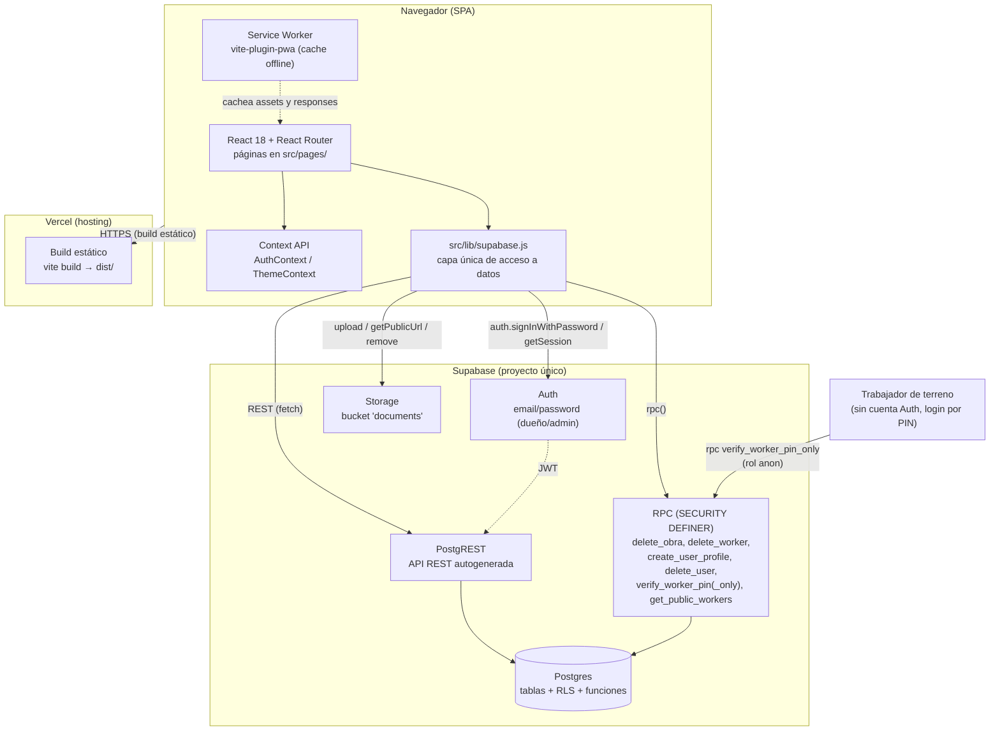

# ARCHITECTURE.md — VAION / Control Obras 360

## 1. Resumen

VAION (nombre interno del proyecto: `control-obras-360`) es una aplicación web de gestión de obras de construcción, multi-empresa (multi-tenant), con roles diferenciados (dueño, administrativo, trabajador de terreno). Es una **Single Page Application (SPA)** sin backend propio: toda la lógica de negocio vive en el cliente (React) y el acceso a datos se hace directo contra Supabase (Postgres + Auth + Storage) usando el SDK `@supabase/supabase-js`.

No existe un servidor de aplicación intermedio (Node/Express/etc.) — Supabase actúa como backend completo vía su API REST autogenerada (PostgREST), su capa de autenticación, su Storage de archivos, y funciones RPC en Postgres para operaciones que requieren privilegios elevados.

## 2. Diagrama de arquitectura



## 3. Stack tecnológico

### Frontend

| Paquete | Versión instalada | Propósito |
|---|---|---|
| `react` | 18.3.1 | UI |
| `react-dom` | 18.3.1 | Render DOM |
| `react-router-dom` | 6.30.3 | Ruteo SPA |
| `@supabase/supabase-js` | 2.104.1 | Cliente de Supabase (Auth, DB, Storage, RPC) |
| `recharts` | 2.15.4 | Gráficos (Flujo de Caja, EERR) |
| `date-fns` | 3.6.0 | Utilidades de fecha |
| `lucide-react` | 0.441.0 | Set de íconos |

### Build / tooling

| Paquete | Versión instalada | Propósito |
|---|---|---|
| `vite` | 5.4.21 | Bundler / dev server |
| `@vitejs/plugin-react` | 4.7.0 | Soporte JSX/Fast Refresh en Vite |
| `vite-plugin-pwa` | 1.2.0 | Genera manifest + service worker (PWA instalable, cache offline) |
| `tailwindcss` | 3.4.19 | Utilidades CSS |
| `autoprefixer` | 10.5.0 | Prefijos CSS |
| `postcss` | 8.5.10 | Procesamiento CSS |

### Backend / infraestructura de datos

- **Supabase** (proyecto único, sin ambientes dev/staging/prod separados — ver `INFRASTRUCTURE.md`): Postgres, Auth, Storage, RLS, funciones RPC.
- **Vercel**: hosting del build estático + dominio custom `vaion.app`.

No hay ORM, no hay backend Node propio, no hay cola de trabajos, no hay caché externo (Redis, etc.). El único "servidor" además de Supabase es el Service Worker generado por `vite-plugin-pwa`, que cachea assets estáticos y usa estrategia `NetworkFirst` para las llamadas a la API de Supabase (ver `vite.config.js`).

## 4. Patrones de diseño utilizados

- **Capa de acceso a datos centralizada:** todas las llamadas a Supabase pasan por `src/lib/supabase.js` (funciones exportadas tipo `getObras()`, `createGasto()`, etc.). Ninguna página llama a `supabase.from(...)` directamente salvo excepciones puntuales de solo-lectura. Esto concentra la lógica de queries/RLS-awareness en un solo archivo.
- **Context API para estado transversal:** `AuthContext` (sesión, empresa activa, rol, permisos) y `ThemeContext` (dark/light) se inyectan una vez en la raíz y se consumen vía hooks (`useAuth()`, `useTheme()`) — no hay Redux/Zustand ni gestor de estado global adicional.
- **Guard components para autorización:** `ProtectedRoute`, `SelectWorkspaceRoute`, `DuenoRoute` en `App.jsx` envuelven rutas y redirigen o bloquean según sesión/empresa/rol, en vez de chequear permisos dentro de cada página.
- **RLS como límite real de seguridad, no el cliente:** el filtro `empresa_id` en `src/lib/supabase.js` es una variable JS en memoria (`currentEmpresaId`) usada por conveniencia — la seguridad real la impone Postgres RLS verificando `auth.uid()` contra `user_companies`/`is_dueno()`. Ver `DATABASE.md`.
- **RPC con `SECURITY DEFINER` para operaciones privilegiadas:** borrados en cascada (`delete_obra`, `delete_worker`) y creación de usuarios (`create_user_profile`) se hacen vía funciones Postgres que corren con privilegios del dueño de la función, evitando exponer lógica compleja de borrado o bypass de RLS al cliente.
- **Doble modelo de sesión:** usuarios admin/dueño usan Supabase Auth real (JWT); trabajadores de terreno no tienen cuenta Auth — su "sesión" es un objeto guardado en `localStorage` tras verificar su PIN vía RPC (rol `anon`). `AuthContext` unifica ambos bajo una misma interfaz (`user`, `rol`, `isAuth`).
- **Derivación de reglas de negocio desde un único diccionario:** `CATEGORIAS_GASTO` en `helpers.js` es la fuente única de verdad para categorías de egreso y a qué grupo pertenecen (Costo Directo de Obra vs. Gastos Generales) — el resto del código (dashboards, filtros, cálculos financieros) deriva de ese objeto en vez de mantener listas duplicadas.
- **Optimistic UI parcial:** algunas mutaciones (ej. activar/desactivar trabajador en `ControlAsistencia.jsx`) actualizan el estado local antes de confirmar la escritura, revirtiendo si falla.
- **Remount forzado por clave:** al cambiar de empresa activa, `AppLayoutKeyed` usa `key={empresa_id}` sobre el layout para forzar un remount completo de la sección autenticada y evitar estado obsoleto de la empresa anterior.

## 5. Estructura de carpetas

```
control-obras-360/
├── docs/                        — esta documentación técnica
├── supabase/                    — SQL de referencia (NO es una migración formal, ver DATABASE.md)
│   ├── schema.sql                 — schema inicial + RLS permisiva original
│   └── rls_role_based.sql         — migración de RLS a políticas por rol/responsable
├── public/                      — assets estáticos (íconos PWA, favicon)
├── src/
│   ├── App.jsx                  — definición de rutas + guards de auth/rol
│   ├── main.jsx                 — entry point, monta <App/> con los providers
│   ├── index.css                — variables CSS del design system + Tailwind
│   ├── context/
│   │   ├── AuthContext.jsx      — sesión, empresa activa, rol, permisos (PERMISOS)
│   │   └── ThemeContext.jsx     — dark/light mode
│   ├── lib/
│   │   ├── supabase.js          — ÚNICA capa de acceso a datos (CRUD + RPC + Storage)
│   │   └── helpers.js           — formatters (formatCLP, formatDate) y diccionarios de negocio (CATEGORIAS_GASTO, TIPOS_OBRA, ESTADOS_OBRA, TIPOS_DOC, ESTADOS_PAGO)
│   ├── components/
│   │   ├── layout/              — AppLayout (shell con sidebar/topbar), Sidebar, BottomNav (nav mobile)
│   │   └── ui/                  — Badge, Modal, StatCard (componentes genéricos)
│   ├── data/
│   │   └── mockData.js          — datos de ejemplo, remanente del MVP inicial (no se usa en producción, ver PENDIENTE DE CONFIRMAR en RUNBOOK.md)
│   └── pages/                   — una página por ruta principal (ver tabla completa en API.md)
├── vite.config.js               — config de Vite + plugin PWA (manifest, service worker, runtime caching)
├── vercel.json                  — rewrite SPA (todo el tráfico → index.html)
├── package.json
└── .env.local                  — variables de entorno locales (no versionado)
```

### Convenciones observadas

- Cada archivo en `src/pages/` corresponde 1:1 a una ruta de `App.jsx` (con la excepción de que algunas etiquetas del Sidebar no calzan textualmente con el nombre del archivo — ver `API.md`).
- No hay separación en subcarpetas por feature dentro de `pages/` — es una carpeta plana con ~25 archivos.
- No hay tipado estático (no TypeScript, no PropTypes) — el proyecto es 100% JavaScript/JSX.
- No hay archivos de test (`*.test.js`, `*.spec.js`) en el repo — ver `RUNBOOK.md`.
