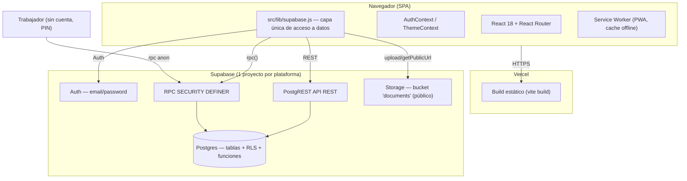

# AUDITORÍA TÉCNICA — VAION / VRION (Control Obras 360)

**Fecha de generación:** 2026-08-28
**Fuente de datos:** consulta SQL directa contra `information_schema`, `pg_policies`, `pg_proc`, `pg_class`, `storage.buckets` corrida en el SQL Editor de Supabase de ambos proyectos (VAION y VRION) — no es documentación inferida del código, es el estado real de la base de datos al momento de esta auditoría.
**Alcance:** arquitectura, infraestructura, base de datos completa, RLS (Row Level Security), Storage, autenticación y roles.

---

## 0. Resumen ejecutivo

VAION y VRION son la **misma aplicación** (mismo repositorio de código, `control-obras-360`) desplegada como dos instancias independientes para dos clientes distintos (VA Constructora y VR Asociados), cada una con su propio proyecto Supabase (base de datos, Auth y Storage separados) y su propio dominio en Vercel. No existe backend propio: toda la lógica vive en el cliente React y el control de acceso real depende enteramente de las políticas RLS de Postgres.

**Hallazgo principal:** la auditoría encontró que el control de acceso a nivel de base de datos es considerablemente más débil que lo que sugiere la app — varias tablas con datos de negocio (egresos, proveedores, PINs de trabajadores, usuarios) son legibles o editables sin las restricciones de rol que la interfaz aparenta imponer, porque las políticas RLS reales son más permisivas que la lógica de la UI. Esto es consistente con el patrón general del proyecto: "la UI decide qué mostrar, no necesariamente quién puede escribir qué".

| Severidad | Cantidad de hallazgos |
|---|---|
| 🔴 Crítico | 4 |
| 🟠 Alto | 3 |
| 🟡 Medio | 3 |
| ⚪ Bajo / informativo | 5 |

---

## 1. Hallazgos de seguridad (ordenados por severidad)

### 🔴 CRÍTICO — 1. Políticas de `expenses` (Egresos) anulan el control de acceso por rol

La tabla `expenses` tiene **4 políticas permisivas simultáneas** para el rol `authenticated`:

```
auth_insert   (INSERT, with_check = true)
auth_select   (SELECT, using = true)
auth_update   (UPDATE, using = true)
expenses_rls  (ALL,    using = is_dueno() OR usuario_id = auth.uid() OR es-responsable-de-la-obra)
```

En Postgres, cuando hay varias políticas **permisivas** sobre la misma tabla/comando, se combinan con **OR**. Esto significa que las 3 primeras políticas (`auth_*`, todas `true` sin condición) **anulan por completo** la restricción de `expenses_rls`: cualquier usuario autenticado —sin importar su rol ni si tiene relación con la obra— puede leer, insertar y modificar **cualquier fila de egresos de toda la empresa**, incluyendo egresos de obras donde no es responsable. La política restrictiva existe en la base pero no tiene efecto real.
Confirmado idéntico en VAION y VRION.

### 🔴 CRÍTICO — 2. `workers.pin` (PIN de marcación) legible por cualquier usuario autenticado

`workers_select_rls`: `SELECT` para rol `authenticated`, `using = true` — sin excepción por rol. La columna `pin` (texto plano, sin hash) está en la misma tabla, así que cualquier `SELECT * FROM workers` desde una sesión autenticada (dueño, administrativo, o cualquier cuenta comprometida) expone el PIN de marcación de **todos los trabajadores**. Con ese PIN se puede: marcar entrada/salida por otro trabajador desde el kiosco (`AccesoTrabajador` usa `verify_worker_pin_only`, rol `anon`, sin ninguna otra verificación), alterando registros de asistencia y el cálculo de costo de mano de obra. Solo la escritura (`workers_write_rls`) exige `is_dueno()` — la lectura no.

### 🔴 CRÍTICO — 3. Tabla `providers` con acceso público total (sin autenticación)

Política `providers_all`: rol **`public`** (no `authenticated`, no `anon` — literalmente cualquiera), comando `ALL`, `using = true`, `with_check = true`. Cualquiera que conozca la URL REST del proyecto Supabase puede leer, insertar, modificar o borrar la tabla completa de proveedores **sin ninguna autenticación**, ni siquiera con la anon key. Confirmado en ambos proyectos.

### 🔴 CRÍTICO — 4. Multi-tenancy no se aplica a nivel de base de datos

`is_dueno()` e `is_administrativo()` verifican **solo el rol** del usuario (en `users.rol` o `user_companies.rol`), nunca la empresa (`empresa_id`) de la fila que se está leyendo/escribiendo. Casi ninguna política de las 30+ tablas filtra por `empresa_id` — el aislamiento entre empresas depende exclusivamente del filtro `.eq('empresa_id', ...)` que vive en JavaScript (`src/lib/supabase.js`), no en la base de datos.

**Esto ya es explotable hoy en VAION**, no es solo un riesgo teórico: la base de VAION todavía contiene los datos originales de **VR Asociados** como respaldo de la migración (`companies` tiene 2 filas, no 1). Como `users_select_rls` es `true` para cualquier autenticado y `companies`/`is_dueno()` no filtran por empresa, un usuario con rol `dueno` en VA Constructora puede —llamando la API REST de Supabase directamente, sin pasar por la app— leer filas de `users`, `companies`, `expenses`, `workers`, etc. que pertenecen a VR Asociados, aunque la UI nunca se las muestre. En VRION este riesgo específico no aplica hoy (`companies` tiene 1 sola fila), pero la función `is_dueno()` tiene el mismo defecto estructural: si alguna vez se agrega una segunda empresa a esa base, el problema reaparece de inmediato.

---

### 🟠 ALTO — 5. Tabla `attendance` completamente abierta al rol `anon` (sin autenticación)

```
anon_insert_attend  INSERT  with_check = true
anon_select_attend  SELECT  using = true
anon_update_attend  UPDATE  using = true
```

Es intencional — el kiosco de trabajadores no usa Supabase Auth — pero no valida absolutamente nada (ni PIN, ni worker_id válido, ni rango horario). Cualquiera con la **anon key** (pública, embebida en el bundle JS que llega a cualquier navegador) puede leer todos los registros de asistencia de todas las obras, o insertar/alterar marcaciones arbitrarias vía `curl`/Postman sin pasar por el kiosco ni por `verify_worker_pin_only`.

### 🟠 ALTO — 6. `users`, `banos_quimicos`, `banos_quimicos_pagos`, `clients`, `tasks` sin control de acceso por rol

- `users_select_rls`: `SELECT` para `authenticated`, `using = true` — cualquier usuario logueado ve nombre, email y rol de **todos** los usuarios de la empresa (y, por el punto 4, potencialmente de la otra empresa en VAION).
- `banos_quimicos`, `banos_quimicos_pagos`, `clients`, `tasks`: policy `"authenticated full access"` con `using/with_check = true` — cualquier usuario autenticado (dueño o administrativo) puede leer/escribir/borrar sin ninguna verificación de propiedad u obra asignada. El límite de "administrativo no ve financieros" que impone `AuthContext.jsx` (`PERMISOS`) es **solo de interfaz**, no de base de datos.

### 🟠 ALTO — Divergencia de RLS entre VAION y VRION en `attendance_auth_rls`

```
VAION: is_dueno() OR es-responsable-de-la-obra
VRION: is_dueno() OR is_administrativo() OR es-responsable-de-la-obra
```

La memoria del proyecto registra que el fix "administrativo puede reasignar asistencia a cualquier obra activa" (2026-07-13) se aplicó "en Supabase SQL Editor de VAION y VRION". El estado real muestra que **solo quedó aplicado en VRION**. En VAION, un usuario `administrativo` hoy no puede editar/reasignar asistencia de una obra donde no es `responsable_id`, contradiciendo el comportamiento esperado y documentado.

---

### 🟡 MEDIO — 7. Bucket de Storage `documents` es público

`public: true` en `storage.buckets`. Cualquier archivo subido (comprobantes, facturas, documentos de obra) es accesible sin autenticación por su URL directa. Las URLs usan UUID (no son enumerables por fuerza bruta en la práctica), pero cualquier link que se comparta, quede cacheado por un navegador/proxy, o se filtre, expone el documento permanentemente sin registro de quién accedió.

### 🟡 MEDIO — 8. `projects` y `worker_projects` legibles sin autenticación

`anon_read_projects` (`SELECT`, `using = true`) y `anon_select` sobre `worker_projects` — nombres de obras, direcciones, presupuestos, fechas y qué trabajador está asignado a qué obra son legibles por cualquiera con la anon key, sin login.

### 🟡 MEDIO — 9. Ninguna política UPDATE/DELETE sobre `user_companies`

Solo existen políticas de `SELECT` e `INSERT`. Cambiar el rol de un usuario dentro de una empresa (de `administrativo` a `dueno`, por ejemplo) o quitar una membresía sin borrar el usuario completo **no es posible desde el cliente** — no hay policy que lo permita, y no existe una RPC para eso (solo `delete_user`, que borra todo). No es una falla de seguridad, es un gap funcional: si Pedro necesita cambiar el rol de un usuario existente, hoy no hay forma de hacerlo sin tocar la base directamente.

---

### ⚪ BAJO / INFORMATIVO

- **10. RPCs legacy activas:** `verify_worker_pin(worker_id, pin)` (reemplazada por `verify_worker_pin_only`) y `get_public_workers()` siguen existiendo como funciones `SECURITY DEFINER` en ambas bases. No se verificaron sus grants de `EXECUTE` en esta auditoría (no se consultó `information_schema.role_routine_grants`) — si `anon`/`authenticated` todavía tienen permiso de ejecutarlas, son código muerto invocable desde fuera de la app. Recomendado: verificar grants y revocar si no se usan.
- **11. Trigger `handle_new_user_companies()` hardcodea un email** (`aballesteros@vaconstructora.cl`) — remanente de una migración puntual, presente solo en VAION (correctamente ausente en VRION).
- **12. Sin ambientes de staging/desarrollo separados** — se prueba localmente contra la misma base de datos de producción en ambas plataformas.
- **13. Sin CI/CD** — deploys manuales desde la máquina de Pedro vía Vercel CLI (`vercel build --prod` + `vercel deploy --prebuilt --prod`), sin pipeline de tests/revisión automática antes de producción. Testing automatizado existe solo para el módulo Cotizador (`vitest`, 45 tests) — el resto de la app no tiene tests.
- **14. Fallback hardcodeado de URL + anon key de Supabase en el código fuente** (`src/lib/supabase.js`) — decisión deliberada documentada en el historial de commits para resolver un problema de env vars en Vercel. La anon key es pública por diseño (se embebe en cualquier bundle JS de cualquier SPA con Supabase), no es un secreto filtrado, pero su presencia hardcodeada en el repo sí queda expuesta a cualquiera con acceso al código fuente (no es un problema si el repo es privado).

---

## 2. Arquitectura

**Sin backend propio.** Single Page Application (React) que habla directo contra Supabase (Postgres + Auth + Storage) vía `@supabase/supabase-js`. Supabase actúa como backend completo vía PostgREST (API REST autogenerada), su capa de Auth, Storage de archivos, y funciones RPC en Postgres para operaciones que requieren privilegios elevados.



**Patrones clave:**
- Capa de datos centralizada en `src/lib/supabase.js` (ninguna página llama a `supabase.from()` directo, salvo excepciones puntuales).
- Doble modelo de sesión: dueño/administrativo usan Supabase Auth real (JWT); trabajadores no tienen cuenta — su "sesión" es un objeto en `localStorage` tras verificar PIN vía RPC anónima.
- RPC `SECURITY DEFINER` para operaciones privilegiadas (borrados en cascada, creación de usuarios).
- El filtro `empresa_id` usado en el cliente es una variable en memoria por conveniencia — **no es el mecanismo de seguridad real** (ver hallazgo #4).

## 3. Stack tecnológico

| Capa | Tecnología |
|---|---|
| Frontend | React 18.3 + React Router 6.30 + Vite 5.4 |
| Estilos | Tailwind CSS 3.4 + variables CSS propias (dark mode exclusivo) |
| Gráficos | Recharts 2.15 |
| PDF | jsPDF + jspdf-autotable |
| PWA | vite-plugin-pwa (manifest + Service Worker, cache `NetworkFirst` para Supabase) |
| Backend | Supabase (Postgres administrado + Auth + Storage + PostgREST) — sin servidor propio |
| Hosting | Vercel (build estático) |
| Testing | Vitest — solo módulo Cotizador (45 tests) |

## 4. Infraestructura y deploy

| Plataforma | Dominio | Vercel project | Supabase project |
|---|---|---|---|
| VAION | https://vaion.app | pablozem-sys-projects/vaion | `ffxexpasoneowquvtouz` |
| VRION | https://vrion.vercel.app | vrion (deploy manual, no linkeado al repo) | `sfemjichlximrhcfgwio` (cuenta separada) |

- **Mismo repositorio de código** para ambas — se diferencian por variables de entorno (`VITE_SUPABASE_URL`, `VITE_SUPABASE_ANON_KEY`, `VITE_BRAND_NAME`, `VITE_COMPANY_SLUG`).
- **Deploy VAION:** `npx vercel build --prod && npx vercel deploy --prebuilt --prod`.
- **Deploy VRION:** build local con `.env.local` temporal + `npx vercel deploy ./dist --prod --project vrion` (incluye copiar `vercel.json` a `dist/` manualmente, si se omite se rompen las rutas SPA).
- **Sin CI/CD** — todo manual desde la máquina de desarrollo. El build empaqueta el working directory tal como está en el momento (no solo lo commiteado a git).
- **Variables de entorno:** solo `VITE_SUPABASE_URL` y `VITE_SUPABASE_ANON_KEY` (públicas por diseño). No hay `SERVICE_ROLE_KEY` en el cliente en ningún punto.
- **PWA:** Service Worker con precache de assets + runtime caching `NetworkFirst` para la API de Supabase y `CacheFirst` para Google Fonts.

## 5. Base de datos — resumen por proyecto

| | VAION | VRION |
|---|---|---|
| Tablas en `public` | 31 (incluye `descuento_tramo`, módulo Cotizador completo) | 30 (sin `descuento_tramo` — migración de descuentos no corrida ahí) |
| `companies` | **2 filas** (VA Constructora + datos residuales de VR Asociados, nunca borrados) | 1 fila (solo VR Asociados) |
| `users` / `user_companies` | 4 / 9 | 5 / 5 |
| `projects` (obras) | 20 | 9 |
| `workers` | 26 | 17 |
| `expenses` | 637 | 129 |
| `attendance` | 600 | 185 |
| `providers` | 101 | 99 |
| RLS habilitado | Todas las tablas de `public` (31/31) | Todas las tablas de `public` (30/30) |
| `rls_forced` | `false` en todas (el dueño/owner de las tablas podría saltarse RLS; no es relevante en Supabase salvo uso directo del rol `postgres`) | igual |

**Extensiones instaladas (ambas):** `plpgsql`, `pg_stat_statements`, `uuid-ossp`, `pgcrypto`, `supabase_vault`.

### 5.1 Funciones (`SECURITY DEFINER` marcadas)

| Función | Seguridad | Propósito |
|---|---|---|
| `is_dueno()` | DEFINER | true si el usuario tiene rol `dueno` en `users` **o** en `user_companies` (sin filtrar empresa — ver hallazgo #4) |
| `is_administrativo()` | DEFINER | análogo para rol `administrativo` |
| `create_user_profile(...)` | DEFINER | crea/actualiza fila en `public.users` |
| `delete_user(user_id)` | DEFINER | valida `is_dueno()`, borra `user_companies` → `users` → `auth.users` |
| `delete_obra(project_id)` | DEFINER | borra en cascada: `accounts_receivable`, `accounts_payable`, `worker_projects`, `attendance`, `projects` |
| `delete_worker(worker_id)` | DEFINER | borra en cascada: `worker_projects`, `attendance`, `workers` |
| `verify_worker_pin_only(pin, company_slug)` | DEFINER | login de kiosco, valida PIN + empresa por slug — **usada actualmente** |
| `verify_worker_pin(worker_id, pin)` | DEFINER | versión legacy sin `company_slug` — código muerto probable |
| `get_public_workers()` | DEFINER | lista trabajadores activos — código muerto probable |
| `handle_new_user_companies()` | DEFINER (trigger) | hardcodea email `aballesteros@vaconstructora.cl` — legacy, solo en VAION |
| `cotizador_tiene_acceso(cotizacion_id)` | DEFINER | valida que el usuario pertenezca (dueño/administrativo) a la empresa dueña de esa cotización — **correctamente scoped por empresa**, a diferencia de `is_dueno()` |
| `get_dashboard_kpis`, `get_obra_metrics`, `get_flujo_caja_mensual`, `get_flujo_caja_semanal`, `get_meses_disponibles` | DEFINER | agregaciones server-side para performance (2026-07-30/31), reciben `p_empresa_id` explícito como parámetro |
| `cotizador_capitulo_de_sub_bloque`, `cotizador_cotizacion_de_capitulo`, `cotizador_cotizacion_de_paquete` | INVOKER | helpers de navegación de jerarquía del cotizador |

Nota: en VAION estas 3 últimas funciones INVOKER incluyen `SET search_path TO 'public'`; en VRION no lo tienen. Como son `LANGUAGE sql STABLE` sin `SECURITY DEFINER`, el riesgo de `search_path` hijacking es bajo, pero es una inconsistencia entre ambas bases que valdría unificar.

### 5.2 Storage

| Bucket | Público | Políticas |
|---|---|---|
| `documents` | **sí** (`public: true`) | INSERT/SELECT/DELETE solo para `authenticated`, condicionadas a `bucket_id = 'documents'` — sin UPDATE explícito, sin restricción por empresa/obra |

## 6. Roles y permisos (capa de aplicación, `AuthContext.jsx`)

| Permiso | dueño | administrativo | trabajador |
|---|---|---|---|
| Ver Ingresos / Margen / EERR / Flujo de Caja / CxC | ✅ | ❌ | — |
| Ver CxP / Asistencia / Obras / Documentos | ✅ | ✅ | — |
| Subir Egresos | ✅ | ✅ | — |
| Editar todo | ✅ | ❌ | — |
| Solo asistencia (kiosco) | — | — | ✅ |

**Importante para la auditoría:** esta tabla describe qué **muestra la interfaz**, no qué permite realmente la base de datos. Como se detalla en los hallazgos #1, #5 y #6, buena parte de estas restricciones (financieros para administrativo, acceso a egresos, asistencia, baños químicos, clientes, tareas) **no están reforzadas por RLS** — un usuario autenticado con herramientas como `curl` o Postman, usando su propio token de sesión, puede saltarse estos límites llamando directo a la API REST de Supabase.

**Autenticación:**
- Dueño/administrativo: Supabase Auth, `email + password`, sesión JWT persistida en `localStorage` (`sb-*`), `autoRefreshToken: true`.
- Trabajador: sin cuenta Auth — PIN de 4 dígitos (texto plano en `workers.pin`) verificado vía RPC `verify_worker_pin_only` (rol `anon`), sesión guardada como objeto plano en `localStorage` (`vaion_worker_session`), sin JWT ni expiración.

## 7. Recomendaciones priorizadas

1. **Eliminar las policies `auth_insert`/`auth_select`/`auth_update` de `expenses`** (dejan sin efecto `expenses_rls`) en ambos proyectos.
2. **Restringir `providers_all`** — quitar el rol `public` de esa policy; si se necesita acceso sin sesión de dueño específica, usar `authenticated` como mínimo.
3. **Quitar `pin` del `SELECT` general de `workers`** — requiere separar la tabla (ej. tabla `worker_pins` aparte con policy propia solo accesible vía RPC `SECURITY DEFINER`) o mover la verificación de PIN enteramente a una función que nunca exponga la columna por REST directo.
4. **Decidir sobre los datos residuales de VR Asociados en la base de VAION** — si ya no se usan, borrarlos; si se mantienen "de respaldo", documentar el riesgo aceptado explícitamente o migrar `is_dueno()`/`is_administrativo()` para que validen `empresa_id` también.
5. **Agregar `and empresa_id = ...` (o el JOIN equivalente) a las policies de `users`, `banos_quimicos*`, `clients`, `tasks`** para que dejen de ser de acceso total entre roles/empresas.
6. **Igualar `attendance_auth_rls` de VAION con la de VRION** (agregar `is_administrativo()`) para que el comportamiento documentado sea real en ambas plataformas.
7. **Evaluar si el bucket `documents` necesita ser público** — si no, cambiar a privado y servir vía URLs firmadas (`createSignedUrl`).
8. **Revisar y revocar grants de `EXECUTE`** sobre `verify_worker_pin` (legacy) y `get_public_workers()` si no están en uso.
9. **Agregar policies UPDATE/DELETE a `user_companies`** (o una RPC dedicada) si se necesita poder cambiar el rol de un usuario existente sin borrarlo.
