# DATABASE.md — VAION / Control Obras 360

## ⚠️ Nota metodológica importante

Este documento se construyó combinando **dos fuentes**:

1. Los archivos SQL versionados en `supabase/schema.sql` y `supabase/rls_role_based.sql` (schema y políticas RLS tal como se definieron en su momento).
2. **Ingeniería inversa del código** (`src/lib/supabase.js` y las páginas que consumen cada tabla) para las tablas y columnas que **no existen en ningún archivo SQL del repo** — es decir, se crearon directamente en Supabase Dashboard sin dejar el DDL versionado.

Las tablas del punto 2 (`companies`, `user_companies`, `additional_sales`, `banos_quimicos`, `banos_quimicos_pagos`, `tasks`, `providers`, `worker_projects`, y columnas nuevas en tablas existentes como `empresa_id`, `pin`, `clave`) están marcadas explícitamente abajo. Sus tipos de dato exactos, constraints, defaults e índices son una **inferencia razonable desde el uso en código**, no una lectura directa del esquema — están marcados **PENDIENTE DE CONFIRMAR** donde el tipo/constraint no es deducible con certeza.

**Recomendación:** exportar el schema real (`pg_dump --schema-only` o el "Database → Schema Visualizer" de Supabase Dashboard) y reemplazar las secciones marcadas para tener una fuente 100% verificada.

## 1. Diagrama entidad-relación

```mermaid
erDiagram
    companies ||--o{ user_companies : "tiene miembros"
    users ||--o{ user_companies : "pertenece a"
    companies ||--o{ projects : "empresa_id"
    companies ||--o{ expenses : "empresa_id"
    companies ||--o{ income : "empresa_id"
    companies ||--o{ documents : "empresa_id"
    companies ||--o{ workers : "empresa_id"
    companies ||--o{ accounts_payable : "empresa_id"
    companies ||--o{ accounts_receivable : "empresa_id"
    companies ||--o{ banos_quimicos : "empresa_id"
    companies ||--o{ tasks : "empresa_id"

    clients ||--o{ projects : "client_id"
    clients ||--o{ accounts_receivable : "client_id"

    projects ||--o{ expenses : "project_id"
    projects ||--o{ income : "project_id"
    projects ||--o{ additional_sales : "project_id"
    projects ||--o{ accounts_payable : "project_id"
    projects ||--o{ accounts_receivable : "project_id"
    projects ||--o{ documents : "project_id"
    projects ||--o{ attendance : "project_id"
    projects ||--o{ geolocation_logs : "project_id"
    projects ||--o{ banos_quimicos : "project_id"
    projects ||--o{ tasks : "obra_id"
    projects ||--o{ worker_projects : "project_id"
    projects }o--|| users : "responsable_id"

    workers ||--o{ attendance : "worker_id"
    workers ||--o{ worker_projects : "worker_id"

    banos_quimicos ||--o{ banos_quimicos_pagos : "bano_id"
    expenses ||--o| banos_quimicos : "expense_id (origen)"

    expenses }o--|| geolocation_logs : "expense_id"
    users ||--o{ expenses : "usuario_id"
    users ||--o{ geolocation_logs : "usuario_id"
    users ||--o{ accounts_payable : "responsable_id"

    users {
        uuid id PK "= auth.users.id"
        text nombre
        text email
        text rol "dueno | administrativo (legacy/global)"
        text avatar
        timestamptz created_at
    }

    companies {
        uuid id PK
        text nombre
        text slug
    }

    user_companies {
        uuid user_id FK
        uuid empresa_id FK
        text rol "dueno | administrativo — ROL EFECTIVO por empresa"
    }

    clients {
        uuid id PK
        text nombre
        text email
        text telefono
        timestamptz created_at
    }

    projects {
        uuid id PK
        uuid empresa_id FK
        text nombre
        uuid client_id FK
        text direccion
        text tipo "piscina|quincho|ampliacion|remodelacion|360|otro"
        date fecha_inicio
        date fecha_termino
        numeric presupuesto
        uuid responsable_id FK
        text estado "cotizada|en_ejecucion|pausada|finalizada"
        numeric lat
        numeric lng
        text descripcion
        integer avance
        text clave "PENDIENTE DE CONFIRMAR — no usado en UI actual"
        timestamptz created_at
    }

    workers {
        uuid id PK
        uuid empresa_id FK
        text nombre
        text avatar
        integer valor_hora
        text pin "4 dígitos, login de kiosco"
        boolean activo
        timestamptz created_at
    }

    worker_projects {
        uuid worker_id FK
        uuid project_id FK
    }

    expenses {
        uuid id PK
        uuid empresa_id FK
        uuid project_id FK "null = Gasto General (GAV)"
        numeric monto
        text categoria "ver CATEGORIAS_GASTO en helpers.js"
        text proveedor
        date fecha
        text medio_pago "contado|credito"
        integer plazo_credito "meses, si medio_pago=credito"
        text comentario
        text documento_url
        numeric lat
        numeric lng
        uuid usuario_id FK
        text estado "pendiente|pagado"
        timestamptz created_at
    }

    income {
        uuid id PK
        uuid empresa_id FK
        uuid project_id FK
        text tipo "anticipo|estado_pago|liquidacion"
        numeric monto
        date fecha
        text descripcion
        text medio_pago
        text estado
        timestamptz created_at
    }

    additional_sales {
        uuid id PK
        uuid project_id FK
        text descripcion
        numeric monto
        text documento_url
        text tipo "adicional|descuento"
        timestamptz created_at
    }

    accounts_payable {
        uuid id PK
        uuid empresa_id FK
        uuid project_id FK
        text proveedor
        numeric monto
        date fecha_emision
        date fecha_vencimiento
        text estado "pendiente|pagado|vencido|proximo"
        text documento_url
        uuid responsable_id FK
        text descripcion
        timestamptz created_at
    }

    accounts_receivable {
        uuid id PK
        uuid empresa_id FK
        uuid project_id FK
        uuid client_id FK
        numeric monto_contrato
        numeric cobrado
        numeric saldo_pendiente
        date fecha_compromiso
        text estado "pendiente|cobrado|vencido"
        text descripcion
        timestamptz created_at
    }

    documents {
        uuid id PK
        uuid empresa_id FK
        uuid project_id FK
        text tipo "factura|boleta|cotizacion|contrato|foto|permiso|comprobante"
        text nombre
        text archivo_url
        date fecha
        text proveedor
        numeric monto
        text categoria
        text tamaño
        timestamptz created_at
    }

    attendance {
        uuid id PK
        uuid worker_id FK
        uuid project_id FK
        date fecha
        timestamptz entrada
        numeric lat_entrada
        numeric lng_entrada
        timestamptz salida
        numeric lat_salida
        numeric lng_salida
        numeric horas_trabajadas
        integer valor_hora
        numeric costo_total
        timestamptz created_at
    }

    geolocation_logs {
        uuid id PK
        uuid project_id FK
        uuid expense_id FK
        numeric lat
        numeric lng
        uuid usuario_id FK
        timestamptz created_at
    }

    banos_quimicos {
        uuid id PK
        uuid empresa_id FK
        uuid project_id FK
        uuid expense_id FK "egreso de origen"
        text proveedor
        date fecha_entrada
        date fecha_salida
        numeric monto_mensual
        text estado "activo|retirado"
        boolean pagado
        text notas
        timestamptz created_at
    }

    banos_quimicos_pagos {
        uuid id PK
        uuid bano_id FK
        date fecha_pago
        numeric monto
        text descripcion
        timestamptz created_at
    }

    tasks {
        uuid id PK
        uuid empresa_id FK
        uuid obra_id FK "nota: se llama obra_id, no project_id"
        text tarea
        text status "pendiente|finalizado"
        timestamptz completed_at
        timestamptz created_at
    }

    providers {
        uuid id PK
        text nombre "UNIQUE (usado en upsert onConflict)"
    }
```



## 2. Tablas — detalle

### Tablas del schema original (`supabase/schema.sql`, confirmadas por SQL versionado)

| Tabla | Columnas | Notas |
|---|---|---|
| `clients` | `id, nombre, email, telefono, created_at` | Sin cambios respecto al SQL original. |
| `users` | `id (FK auth.users), nombre, email, rol, avatar, created_at` | `rol` es texto plano (`dueno`/`administrativo`), **no** hay FK a una tabla `roles` — esa tabla se menciona en un comentario legacy de `supabase.js` pero no se usa (`rol_id` no aparece en ningún query real). Se autocompleta vía trigger `handle_new_user()` al crear un usuario en `auth.users`. |
| `workers` | `id, nombre, avatar, valor_hora, activo, created_at` + **`pin` y `empresa_id` agregadas después** (no en `schema.sql`) | `pin` (texto, 4 dígitos) habilita el login de kiosco sin cuenta Auth. |
| `projects` | `id, nombre, client_id, direccion, tipo, fecha_inicio, fecha_termino, presupuesto, responsable_id, estado, lat, lng, descripcion, avance, created_at` + **`empresa_id` y `clave` agregadas después** | `clave` es referenciada por `getObraByClaveActiva()` en `supabase.js` pero esa función **no se llama desde ninguna página actualmente** — parece código muerto/feature no terminada. |
| `expenses` | `id, project_id, monto, categoria, proveedor, fecha, medio_pago, comentario, documento_url, lat, lng, usuario_id, estado, created_at` + **`empresa_id` y `plazo_credito` agregadas después** | `project_id = null` representa un Gasto General (GAV, sin obra asociada). |
| `income` | `id, project_id, tipo, monto, fecha, descripcion, medio_pago, estado, created_at` + **`empresa_id` agregada después** | |
| `accounts_payable` | `id, project_id, proveedor, monto, fecha_emision, fecha_vencimiento, estado, documento_url, responsable_id, descripcion, created_at` + **`empresa_id` agregada después** | |
| `accounts_receivable` | `id, project_id, client_id, monto_contrato, cobrado, saldo_pendiente, fecha_compromiso, estado, descripcion, created_at` + **`empresa_id` agregada después** | |
| `documents` | `id, project_id, tipo, nombre, archivo_url, fecha, proveedor, monto, categoria, tamaño, created_at` + **`empresa_id` agregada después** | Ver sección "Documentos" más abajo — es la fuente única de la Biblioteca documental. |
| `attendance` | `id, worker_id, project_id, fecha, entrada, lat_entrada, lng_entrada, salida, lat_salida, lng_salida, horas_trabajadas, valor_hora, costo_total, created_at` | Sin cambios detectados respecto al original. |
| `geolocation_logs` | `id, project_id, expense_id, lat, lng, usuario_id, created_at` | Sin cambios detectados. |

### Tablas agregadas después (sin DDL en el repo — reconstruidas desde `src/lib/supabase.js`)

| Tabla | Columnas (inferidas) | Usada en |
|---|---|---|
| `companies` | `id, nombre, slug` | `AuthContext.jsx`, `SelectWorkspace.jsx`, `getUserCompanies()` |
| `user_companies` | `user_id, empresa_id, rol` | Relación multi-tenant; `rol` acá es el **rol efectivo** que usa `AuthContext` (no `users.rol`) |
| `additional_sales` | `id, project_id, descripcion, monto, documento_url, tipo (adicional\|descuento), created_at` | Ventas Adicionales / Alcance no ejecutado en `DetalleObra.jsx`. **No tiene `empresa_id` propio** — su alcance de empresa se hereda vía `project_id → projects.empresa_id`. |
| `worker_projects` | `worker_id, project_id` (tabla junction, sin PK propio visible) | Asignación de obras a trabajadores en `ControlAsistencia.jsx` |
| `banos_quimicos` | `id, empresa_id, project_id, expense_id, proveedor, fecha_entrada, fecha_salida, monto_mensual, estado (activo\|retirado), pagado (boolean), notas, created_at` | `BanosQuimicos.jsx`, generado también automáticamente desde `NuevoGasto.jsx` cuando la categoría es `banio_quimico` |
| `banos_quimicos_pagos` | `id, bano_id, fecha_pago, monto, descripcion, created_at` | Historial de pagos de un baño químico activo |
| `tasks` | `id, empresa_id, obra_id, tarea, status (pendiente\|finalizado), completed_at, created_at` | `Gestion.jsx` — **nota de nomenclatura:** usa `obra_id`, no `project_id` como el resto de las tablas |
| `providers` | `id, nombre (UNIQUE)` | Autocompletado de proveedores en `NuevoGasto.jsx` (`upsertProvider`, `onConflict: 'nombre'`) |

**Columnas `empresa_id` agregadas post-hoc:** `projects`, `workers`, `expenses`, `income`, `accounts_payable`, `accounts_receivable`, `documents`, `banos_quimicos`, `tasks` tienen todas una columna `empresa_id` (uuid, FK a `companies.id`, inferido) que no existe en `schema.sql`. Esto fue el mecanismo elegido para convertir la app de single-tenant a multi-tenant sin rehacer el modelo de datos completo.

## 3. Row Level Security (RLS) y modelo de seguridad

### Confirmado por SQL versionado (`supabase/rls_role_based.sql`)

Función helper:

```sql
CREATE OR REPLACE FUNCTION public.is_dueno()
RETURNS boolean
LANGUAGE sql SECURITY DEFINER STABLE
AS $$
  SELECT EXISTS (
    SELECT 1 FROM public.users
    WHERE id = auth.uid() AND rol = 'dueno'
  );
$$;
```

Regla general aplicada a `projects`, `expenses`, `additional_sales`, `income`, `accounts_payable`, `accounts_receivable`, `documents`, `attendance`, `geolocation_logs`, `worker_projects`:

> `is_dueno() OR (el usuario es responsable_id del proyecto relacionado, o dueño directo del registro)`

Reglas especiales:
- `clients`, `providers`: acceso total para cualquier usuario autenticado (recurso compartido entre toda la empresa).
- `users`: **todos** los autenticados pueden `SELECT` (para poder asignar responsables); solo `is_dueno()` puede `INSERT`/`DELETE`; `UPDATE` permitido a `is_dueno()` o al propio usuario (`id = auth.uid()`).
- `workers`: `SELECT` abierto a autenticados; escritura (`INSERT`/`UPDATE`/`DELETE`) solo `is_dueno()`.
- Rol `anon` (kiosco de trabajador, sin login): `SELECT` en `workers` (solo `activo = true`) y en `projects`; `INSERT`/`UPDATE`/`SELECT` en `attendance`.

### ⚠️ Divergencia conocida entre el SQL versionado y la base real

La función `is_dueno()` de arriba **ya no refleja la versión que corre en producción**. El 2026-06-06 se detectó que un usuario con `users.rol = 'administrativo'` pero `user_companies.rol = 'dueno'` para una empresa específica quedaba bloqueado por todas las políticas RLS (porque `is_dueno()` solo miraba `users.rol`). El fix aplicado directamente en Supabase (no versionado en este repo) fue:

```sql
CREATE OR REPLACE FUNCTION public.is_dueno()
RETURNS boolean
LANGUAGE sql STABLE SECURITY DEFINER
AS $function$
  SELECT EXISTS (
    SELECT 1 FROM public.users
    WHERE id = auth.uid() AND rol = 'dueno'
  )
  OR EXISTS (
    SELECT 1 FROM public.user_companies
    WHERE user_id = auth.uid() AND rol = 'dueno'
  );
$function$
```

Es decir: **la fuente de verdad real del rol es `user_companies.rol` (por empresa), no `users.rol` (global/legacy)**. `rls_role_based.sql` en el repo no refleja este fix — cualquier lectura del RLS real debe hacerse desde Supabase Dashboard, no solo desde el archivo.

### Storage — bucket `documents`

Confirmado y aplicado directamente en Supabase (no versionado como archivo SQL en el repo):

```sql
create policy "Authenticated users can upload documents"
on storage.objects for insert to authenticated with check (bucket_id = 'documents');

create policy "Authenticated users can view documents"
on storage.objects for select to authenticated using (bucket_id = 'documents');

create policy "Authenticated users can delete documents"
on storage.objects for delete to authenticated using (bucket_id = 'documents');
```

El bucket es **público** (para que `getPublicUrl()` funcione sin URLs firmadas). Antes de este fix (2026-07-08), el bucket existía pero sin política de `INSERT`, por lo que **toda subida de archivos fallaba** con `"new row violates row-level security policy"` — ver `RUNBOOK.md`.

### ⚠️ Políticas por empresa (`empresa_id`) — no confirmadas en ningún SQL

Ningún archivo del repo define políticas RLS que filtren por `empresa_id`. Dado que el multi-tenant (`companies`/`user_companies`/`empresa_id`) se agregó después de `rls_role_based.sql`, es de esperar que existan políticas adicionales en Supabase que reemplazan o complementan las de `responsable_id` para scopear por empresa — **PENDIENTE DE CONFIRMAR directamente en Supabase Dashboard → Authentication → Policies**, ya que no hay forma de verificarlo desde este repositorio.

## 4. Migraciones

**No existe un sistema formal de migraciones** (no hay Supabase CLI, no hay carpeta `supabase/migrations/` con archivos numerados/timestamped). Lo que existe:

1. `supabase/schema.sql` — schema inicial completo + RLS permisiva (`auth_all`), pensado para correrse una sola vez ("Correr en: Supabase Dashboard → SQL Editor → New query").
2. `supabase/rls_role_based.sql` — segunda pasada que reemplaza las políticas permisivas por políticas basadas en rol/responsable.
3. **Todo cambio posterior** (multi-tenancy completo, fix de `is_dueno()`, políticas de Storage, nuevas tablas `banos_quimicos`/`tasks`/`providers`/`additional_sales`, nuevas columnas) se aplicó **directamente en Supabase SQL Editor**, sin dejar un tercer archivo `.sql` versionado en el repo.

**Riesgo operativo:** si se necesita recrear el proyecto de Supabase desde cero, los dos archivos SQL del repo **no son suficientes** — falta una porción significativa del schema real. Se recomienda exportar el schema completo actual (`pg_dump --schema-only`, o desde el SQL Editor con `\d+` por tabla) y versionarlo como un tercer archivo (ej. `supabase/schema_v2_multitenant.sql`) para cerrar esta brecha.
